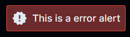

<div align="center" >

# UI Game

Create, Alter UI as simple as a game.

[](https://app.netlify.com/sites/ui-game/deploys)

UI Game is a component library that helps you create a seamless UI using predefined CSS classes so you don't have to worry about styling. Using the UI Game library will help you focus more on functionality than writing CSS for simple things.

</div>

---

# **Installation**

To start using the components in your project, Copy-paste the stylesheet `<link>` into your `<head>` before all other stylesheets to load our CSS.

```html
<link rel="stylesheet" href="https://ui-game.netlify.app/styles.css" />
```

---

# Components in the UI Game Library

-   [Alert](#Alert)
-   [Avatar](#Avatar)
-   [Badge](#badge)
-   [Button](#button)
-   [Card](#card)
-   [Image](#image)
-   [Input](#input)
-   [List](#list)
-   [Modal](#modal)
-   [Text Utilities](#text-utilities)

---

## Alert

Alerts are used to notify the user of an important event. They can be used to inform the user of an event, or to prompt the user to take an action.

### Error Alert



### Error Alert


### Error Alert


### Error Alert


### [Checkout code for Alerts](https://ui-game.netlify.app/pages/getting-started/getting-started.html#alert)

---

## Avatar

Avatars are objects that represent the user's identity on screen.

### Simple avatar


### Avatar with custom size


### [Check out code for avatar](https://ui-game.netlify.app/pages/getting-started/getting-started.html#avatar).

---

## Badge

Badges are used to show the certain status of that particular UI element.

### Badge with a number.


### Badge with status.


### [Check out code for badge](https://ui-game.netlify.app/pages/getting-started/getting-started.html#badge).

---

## Button

Buttons are objects that user's uses to interact with the application.

### Primary button.


### Secondary button.


### Danger button.


### FAB(Floating Action Button) button.


### [Check out code for button](https://ui-game.netlify.app/pages/getting-started/getting-started.html#button).

---

## Card

Cards are used to display content in a container.

### Card with badge


### Card with dismiss


### Card with text overlay


### Text only card


### Horizontal card


### [Check out code for card](https://ui-game.netlify.app/pages/getting-started/getting-started.html#card).

---

## Image

Image can be used to display picture on the website.

### Rounded square Image


-   ### Circular Image

-   ### Responsive Image

### [Check out code for images](https://ui-game.netlify.app/pages/getting-started/getting-started.html#image).

---

## Input

Input can be used to take input from your user.

### Input


### Error input


### Success input


### [Check out code for input](https://ui-game.netlify.app/pages/getting-started/getting-started.html#input).

---

## List

List can be used to show a list of items.

### List Group


### Active list item


### Disabled list item


### Notification List

 

### List without border


### [Check out code for list](https://ui-game.netlify.app/pages/getting-started/getting-started.html#list).

---

## Modal

Modal can be used for creating dialog boxes

### Simple Modal


### [Check out code for modal](https://ui-game.netlify.app/pages/getting-started/getting-started.html#modal).

---

## Text Utilities

### Headings


### Small Text


### Aligned Text


### [Check out code for text utilities](https://ui-game.netlify.app/pages/getting-started/getting-started.html#text-utilities).

---

<div align="center" >

# Check out the [DOCUMENTATION](https://ui-game.netlify.app/pages/getting-started/getting-started.html) for more information.

</div>
